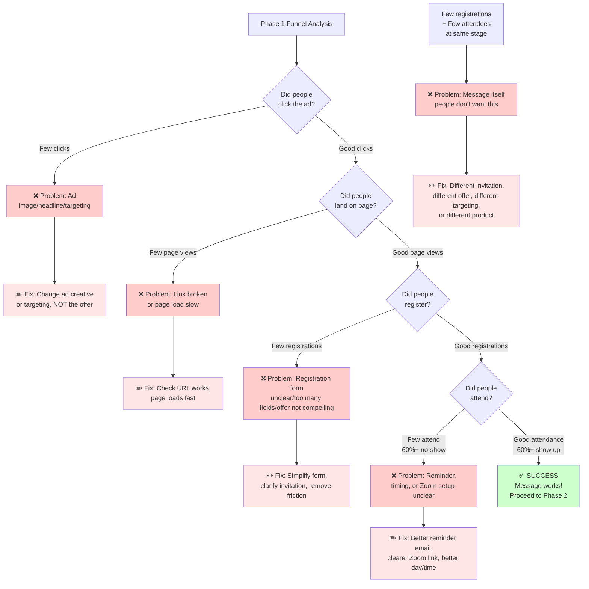

# Phase 1 Diagnostic Flowchart

How to diagnose where the problem is in your funnel based on Phase 1 metrics.

---

## Reading the Flowchart

**Red boxes** = Problem diagnosis
**Light red boxes** = Fix/action to take
**Green box** = Success (message works, move to Phase 2)

**The path depends on your data:**

- High clicks but low page views? → Link/load problem
- High page views but low registrations? → Form/offer problem  
- High registrations but low attendance? → Reminder/timing problem
- Low at every stage? → Message isn't resonating with this audience
